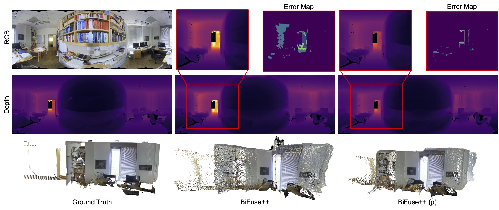

# Depth Anywhere: Enhancing 360 Monocular Depth Estimation via Perspective Distillation and Unlabeled Data Augmentation - Neurips 2024
[arXiv](https://arxiv.org/abs/2406.12849) | [Code]() | [Project Page](https://albert100121.github.io/Depth-Anywhere/) | [Demo](https://huggingface.co/spaces/Albert-NHWang/Depth-Anywhere-App) | Video (tbd) | Poster (tbd)

<a href="https://arxiv.org/abs/2406.12849"></a> <a href='https://albert100121.github.io/Depth-Anywhere/'></a> [](https://huggingface.co/spaces/Albert-NHWang/Depth-Anywhere-App) <a href='https://huggingface.co/papers/2406.12849'></a>


This is the official implementation of Depth Anywhere, a project that proposes cross-camera model knowledge distillation by leveraging the large amount of perspective data and the capabilities of perspective foundation depth models.


[Depth Anywhere: Enhancing 360 Monocular Depth Estimation via Perspective Distillation and Unlabeled Data Augmentation](https://albert100121.github.io/Depth-Anywhere/)
[Ning-Hsu Wang](http://albert100121.github.io/), [Yu-Lun Liu](https://yulunalexliu.github.io/)<sup>1</sup>
<sup>1</sup>[National Yang Ming Chiao Tung University](https://www.nycu.edu.tw/nycu/en/index)




#### News
- **Sep, 26, 2024**: Paper accepted to Neurips 2024
- **Jun, 24m 2024**: Hugging Face demo released

## Usage
### Environment installation
1. Create an empty environment.
```bash
conda create --name depth-anywhere python=3.8
conda activate depth-anywhere
```

2. Install environments following the offical [Depth Anything](https://github.com/LiheYoung/Depth-Anything)
```bash
git clone https://github.com/LiheYoung/Depth-Anything
cd Depth-Anything
pip install -r requirements.txt
```
3. Install the baseline model of your preference. We listed the model we used in our paper as an example.
- [UniFuse](https://github.com/alibaba/UniFuse-Unidirectional-Fusion)
```bash
cd baseline_models
git clone https://github.com/alibaba/UniFuse-Unidirectional-Fusion.git
pip install -r requirements.txt
```
    
### Pretrained weights

### Running

#### Acknowledgement
**We sincerely appreciate the following research / code / datasets that made our research possible**

- [Depth Anything](https://github.com/LiheYoung/Depth-Anything/tree/main)
- [UniFuse](https://github.com/alibaba/UniFuse-Unidirectional-Fusion)
- [BiFuse++](https://github.com/fuenwang/BiFusev2)
- [EGFormer](https://github.com/yuniw18/EGformer)
- [HoHoNet](https://github.com/sunset1995/HoHoNet)
- [py360converter](https://github.com/sunset1995/py360convert)

